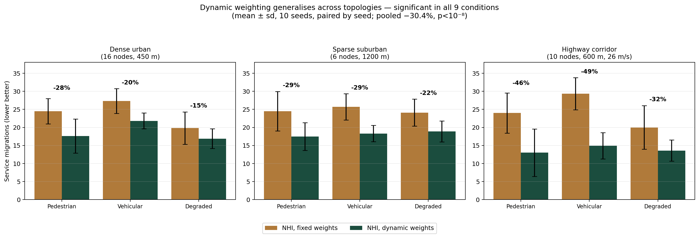

# Adaptive Node Health Index (NHI) for Fog Computing

Battery- and mobility-aware resource allocation for fog computing, evaluated on
**iFogSim2** with **SUMO** traffic and a State-of-Health model trained on the
**NASA PCoE** Li-ion battery dataset.

The scheduler scores candidate fog nodes on nine normalised metrics and adapts
its own weighting to the operating regime. Across 720 simulation runs spanning
three topologies, adaptive weighting reduced service migrations by **30.4 %**
relative to fixed weights (paired, n = 90, p < 10⁻⁸).

---

## Result

Dynamic weighting vs fixed weights, service migrations, paired by seed:

| Topology | Fixed | Dynamic | Change | p |
|---|---|---|---|---|
| Dense urban (16 nodes, 450 m) | 23.87 | 18.77 | **−21.4 %** | < 1e-6 |
| Sparse suburban (6 nodes, 1200 m) | 24.77 | 18.23 | **−26.4 %** | < 1e-6 |
| Highway corridor (10 nodes, 26 m/s) | 24.43 | 13.83 | **−43.4 %** | < 1e-6 |
| **Pooled (n = 90)** | **24.36** | **16.94** | **−30.4 %** | **< 1e-8** |

Significant in all nine topology × scenario conditions. The effect scales with
mobility pressure — largest on the highway, smallest in the dense grid — which
is what the mechanism predicts, since the adaptive step boosts the mobility
term in proportion to dwell-time spread.



Against a dedicated mobility-aware baseline the method is a **trade-off, not a
clean win**: it concedes roughly 4–5 migrations per 60 placements but achieves
significantly fairer battery wear in 8 of 9 conditions. Full numbers, including
everything that did not work, are in [`docs/RESULTS.md`](docs/RESULTS.md).

---

## The index

```
NHI_i = w1·CPU_free + w2·MEM_free + w3·(1/Queue) + w4·(1/Latency)
      + w5·SoC + w6·SoH + w7·Reliability + w8·MobilityStability
      + w9·WearBalance
```

Metrics are min-max normalised across candidates, so a metric that is flat
across the candidate set contributes nothing. Two dispersion signals —
dwell-time spread and SoH spread — scale their own terms' weights each round
(capped at 2.5×), after which the vector is renormalised. The weights behind
any decision can be printed, so the policy stays auditable.

`WearBalance` exists because of a defect found during the study: rewarding high
SoH *alone* sends every task to the healthiest node, wearing it down fastest and
**widening** fleet divergence. Preferring healthy nodes and spreading wear are
different objectives and the index needs both.

---

## Layout

```
src/                     Python: data pipeline, LSTM, SoH service, analysis
java/org/fog/nhi/        The iFogSim2 package (9 classes)
sumo/                    Traffic generation and traces
data/                    Trained weights (battery data downloaded separately)
results/                 720-run CSVs, statistics, figures
docs/RESULTS.md          Full methodology, statistics, limitations
```

## Quick start

```bash
pip install -r requirements.txt

# 1. iFogSim2 + the NHI package  (see java/README.md)
git clone https://github.com/Cloudslab/iFogSim2.git
cp -r java/org/fog/nhi iFogSim2/src/org/fog/
cp sumo/sumo_*.csv iFogSim2/dataset/
cd iFogSim2 && CP=$(find jars -name '*.jar' | tr '\n' ':')
javac -nowarn -cp "$CP" -d out/build $(find src -name '*.java') && cd ..

# 2. SoH service must be running first — the harness aborts without it,
#    rather than silently producing non-LSTM results
python3 src/soh_service.py &

# 3. Run: <csv> <scenario|-> <policy|-> <seedFrom> <seedTo> <topology>
cd iFogSim2
java -cp "out/build:$CP" org.fog.nhi.NHISimulation ./results.csv - - 1 10 dense_urban

# 4. Analyse
cd .. && python3 src/analyze_multiseed.py
```

Training the SoH model from scratch needs the NASA dataset — see
[`data/README.md`](data/README.md). Pre-trained weights are committed, so the
simulation runs without it.

---

## Method notes

**Evaluation is paired by seed.** Each seed fixes topology, node health,
mobility traces and workload; all six policies then run on that identical
instance, so differences are attributable to the policy alone.

**The analysis plan was fixed before the runs.** Primary comparison, test and
secondary metrics were chosen in advance. No policy, metric, seed subset or
topology was selected after seeing results, and all three topologies are
reported.

**Every result row carries an `lstm_ok` flag.** The SoH estimator runs as a
Python service that Java queries over a socket; if any value came from the
fallback rather than the LSTM, the row says so and the plotting script refuses
to chart it. This caught a real failure during development where a slow service
start produced an entire sweep of non-LSTM results.

**Known limitations** are documented in `docs/RESULTS.md` §4.3 and §9. The
largest: iFogSim2 places modules once at simulation start, so the queue term
never discriminates; `BASE_W` was set by reasoning and never tuned; and the SoH
model is evaluated within-cell, because NASA cycles different cells to different
cutoff voltages and cross-cell transfer genuinely fails.

---

## Credits

- **iFogSim2** — CLOUDS Laboratory, University of Melbourne (MIT). Not vendored
  here; no stock file is modified.
- **SUMO** — Eclipse SUMO, German Aerospace Center (DLR) (EPL-2.0).
- **Battery data** — NASA Ames Prognostics Center of Excellence.
